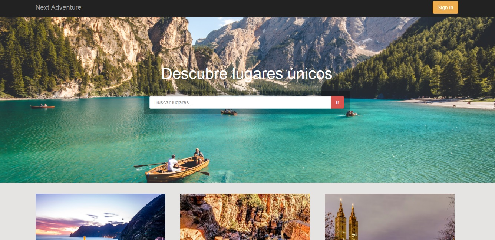
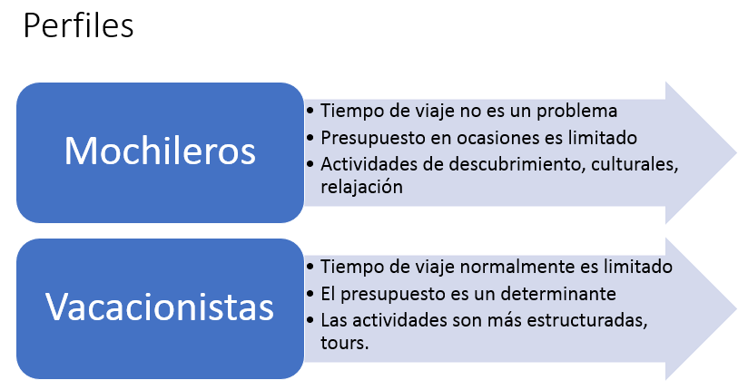
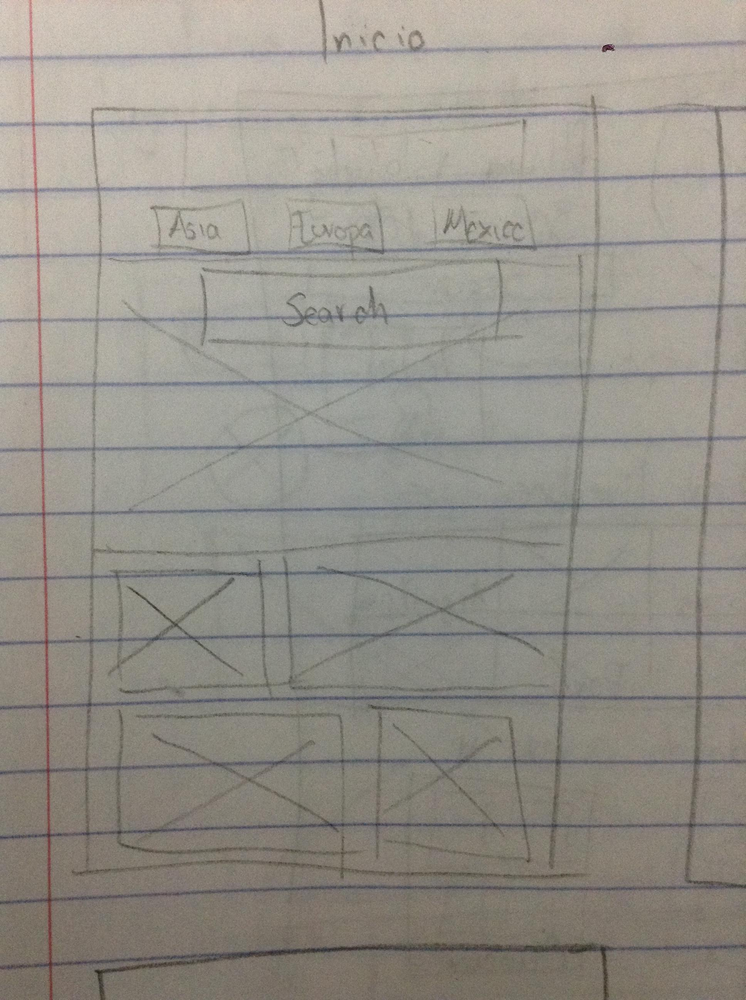
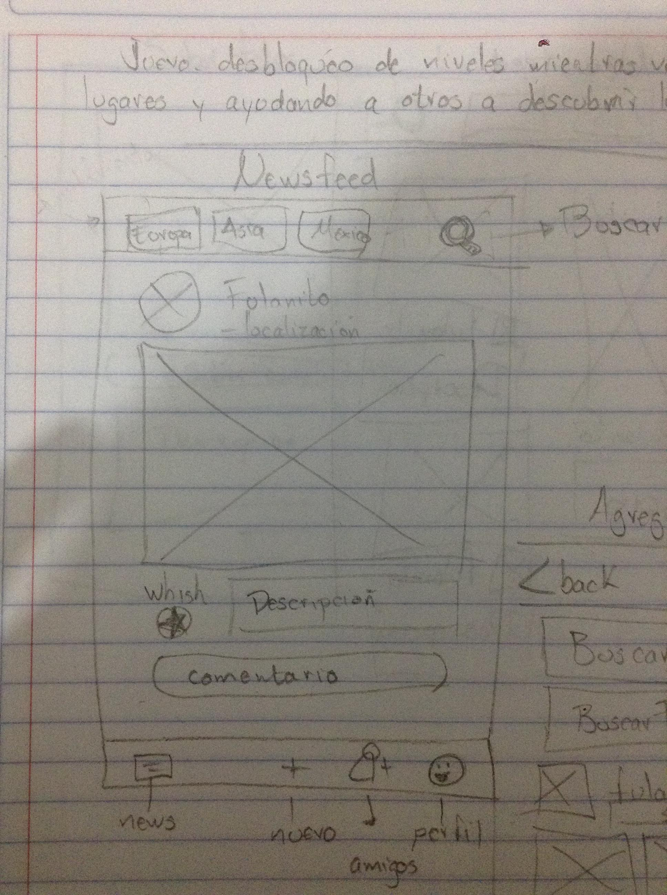
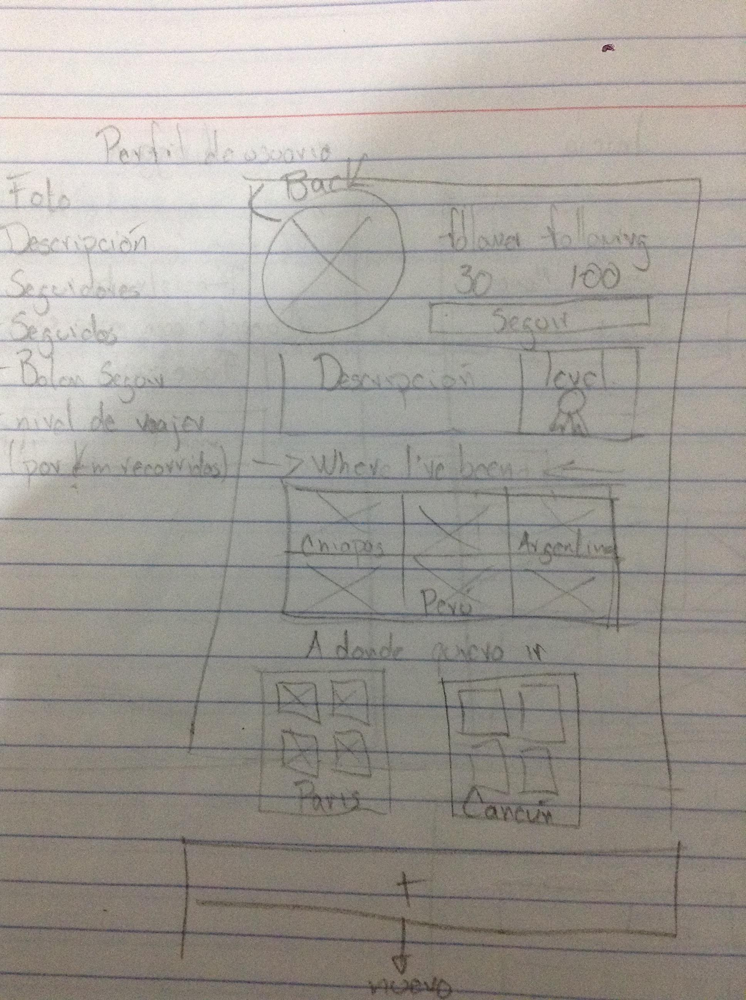

# Red Social

Una red social para personas que viajan y que recomiendan lugares a través de fotografías

#### El reto:
Un empresario se ha acercado a nuestro equipo de desarrollo para darnos la tarea de crear una red social que sea exitosa. La deficición de la tematica, diseño y detalles de dicha red social serán desarrollados por nuestra área de UX.

### Proceso de UX
#### Planeación
##### 1. Empetizar
Nuestra área de UX realizó entrevistas presenciales con personas de diferentes perfiles.

Encontramos los siguientes "pain points":

* Cuando los usuarios planean un viaje comienzan por pensar en el destino pero no siempre tienen claro cúal será.
* Piden o encuentran recomendaciones de otra personas, sean o no amigos.
* Saben que actividades quieren realizar en sus viajes sin embargo no conocen donde pueden realizarlas.
* El tiempo disponible para viajar es un factor para elegir el destino.
* El presupuesto determina el tipo de viaje a realizar sin embargo para algunos usuarios no es un factor determinante.
* Un mismo usuario puede viajar solo, con amigos, familiares, no siempre es el mismo tipo de viaje.

##### 2. Definir
Los perfiles que pudimos definir fueron:

Factores primarios para elegir un destino:
* Elección por tipo de ambiente o actividades que se quieren realizar.
Factores primarios para elegir un destino:
* Tiempo disponible para viajar.
* Presupuesto disponible para realizar las actividades elegidas.
* Busqueda de recomendaciones de lugares nuevos e interesantes

Podemos inferir en solo un factor de los identificados:
Crear una comunidad de personas que compartan sus recomendaciones de destinos visitados mediante fotos inspiradoras.

##### 3. Diseñar

Red social donde te “inspires” e “inspires” a otros a elegir el siguiente destino de viaje, enfocada a mochileros.
* El objetivo principal es que el usuario suba fotos de sus viajes, detallando la localización y la descripción del lugar
* Podrás tener en tu newsfeed las fotos de los viajes y los lugares visitados por tus contactos.
* En tu perfil tendrás dos secciones. Los lugares que has visitado y los lugares a los que quieres ir
* Propuesta: al subir una foto se marcará en tu mapa personal un pin del lugar visitado y calculará los kilómetros recorridos desde tu lugar de origen. Por cada kilometro se darán puntos con los cuales puedes subir de nivel de viajaro

##### 4. Prototipar
El prototipo cubrira los requerimientos minimos de una red social

Página principal

Feed con actualizaciones de tu aamigos

Perfil de usuario

### Alcances del proyecto
